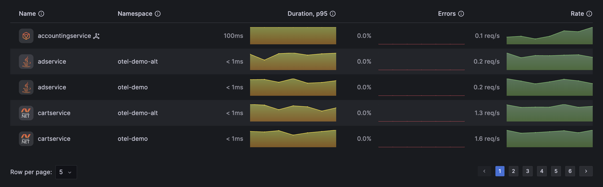

# Nais APM

A Grafana app plugin that provides Application Performance Monitoring (APM) using
OpenTelemetry data from Mimir, Loki, and Tempo. It discovers instrumented services
automatically and presents RED metrics (Rate, Errors, Duration), service dependency
maps, and cross-signal navigation between metrics, traces, and logs.

Built for self-hosted Grafana stacks running the LGTM stack with OpenTelemetry
instrumentation. No proprietary agents, no Grafana Cloud lock-in.



## Features

- **Service Inventory** — auto-discovered table of all instrumented services with health sparklines, SDK language icons, and sort/filter/pagination
- **RED Dashboards** — per-service Rate, Errors, and Duration panels with percentile selectors and exemplar overlays
- **Operations Breakdown** — top operations table and duration distribution histogram per service
- **Service Map** — topology graph showing inter-service dependencies
- **Cross-Signal Navigation** — click a data point on any panel to jump to correlated traces or logs
- **Trace & Log Exploration** — search and browse traces and logs scoped to a service
- **Auto-Detection** — detects span metric names, duration units, and available capabilities from your data

## Prerequisites

- **Grafana** >= 12.0.0
- **Mimir** (or Prometheus) with span-derived metrics
- **Tempo** for distributed traces
- **Loki** for logs *(optional — needed for log correlation)*

### OpenTelemetry Collector

The plugin reads span metrics and service graph metrics produced by an OpenTelemetry
Collector (or Grafana Alloy). You need two connectors configured:

1. **spanmetrics** — converts traces into per-service request/error/duration metrics
2. **servicegraph** — converts traces into inter-service dependency metrics *(optional — needed for service map)*

See [`otel-collector-config.yaml`](otel-collector-config.yaml) for a working example.

### Recommended resource attributes

| Attribute | Purpose |
|-----------|---------|
| `service.name` | **Required.** Identifies each service |
| `service.namespace` | Groups services by team/domain |
| `deployment.environment` | Enables environment filtering |
| `telemetry.sdk.language` | Shows SDK language icon next to service names |
| `http.route` | Produces clean operation names instead of raw URLs |

## Installation

Install the plugin in your Grafana instance:

```sh
grafana-cli plugins install nais-applicationobservability-app
```

Or set it as an environment variable for Docker deployments:

```sh
GF_INSTALL_PLUGINS=nais-applicationobservability-app
```

Then enable the plugin under **Administration > Plugins** in Grafana.

## Configuration

1. Go to the plugin's **Configuration** page
2. Enter data source UIDs for Mimir, Tempo, and Loki
3. Click **Auto-detect capabilities** to verify connectivity and detect metric names
4. Save

### Data sources

| Setting | Purpose | Default |
|---------|---------|---------|
| Metrics (Prometheus/Mimir) UID | Mimir or Prometheus instance with span metrics | *(required)* |
| Traces (Tempo) UID | Default Tempo instance | *(required)* |
| Logs (Loki) UID | Default Loki instance | *(optional)* |

### Per-environment datasource overrides

If you run separate Tempo/Loki instances per environment (e.g., `dev-gcp`,
`prod-gcp`), you can configure per-environment overrides. When a user selects
an environment filter, trace and log links will route to the matching
datasource instead of the default.

Each override maps an environment name (matching `deployment.environment`) to
a Tempo UID and/or Loki UID.

### Detection and overrides

| Setting | Purpose | Default |
|---------|---------|---------|
| Metric namespace | Span metrics prefix (e.g., `traces_span_metrics`) | Auto-detected |
| Duration unit | `ms` or `s` — depends on your OTel Collector config | Auto-detected |

The **Auto-detect** button probes your metrics backend for known span metric
naming patterns and reports what it found: namespace, duration unit, and
number of discovered services. Manual overrides are only needed when
auto-detection fails or when running non-standard pipelines.

## Development

### Quick start

```bash
git clone https://github.com/nais/grafana-otel-plugin.git
cd grafana-otel-plugin
npm install
```

Start the full development stack (Grafana + Mimir + Tempo + Loki + OTel Collector):

```bash
docker compose up
```

In a separate terminal, run the frontend in watch mode:

```bash
npm run dev
```

Open `http://localhost:3000/a/nais-applicationobservability-app/services`.

To build the backend:

```bash
mage -v build:linux
```

### Demo environment

A demo setup with the [OpenTelemetry Demo](https://opentelemetry.io/docs/demo/) microservices
generating realistic traffic:

```bash
docker compose -f docker-compose.demo.yaml up
```

### Commands

| Command | Description |
|---------|-------------|
| `npm run dev` | Frontend watch mode |
| `npm run build` | Production frontend build |
| `npm run test` | Unit tests (watch mode) |
| `npm run test:ci` | Unit tests (CI) |
| `npm run typecheck` | TypeScript type checking |
| `npm run lint` | ESLint |
| `npm run lint:fix` | Auto-fix lint and format |
| `npm run e2e` | Playwright end-to-end tests |
| `mage -v build:linux` | Backend build (Go) |

### Requirements

- Node.js 22 (see [`.nvmrc`](.nvmrc))
- Go 1.25+
- Docker

## Architecture

The plugin has a Go backend and a React frontend.

**Backend** (`pkg/`) — Grafana backend plugin that proxies and aggregates queries to
Mimir, Tempo, and Loki. Handles service discovery, capability detection, and service
graph data aggregation.

**Frontend** (`src/`) — React app using `@grafana/scenes` for panel rendering and
`@grafana/ui` for components.

```
src/
├── pages/
│   ├── ServiceInventory.tsx    # Service list with sparklines and health indicators
│   ├── ServiceOverview.tsx     # Per-service RED panels, traces, logs, operations
│   └── ServiceMap.tsx          # Topology graph
├── components/
│   └── AppConfig/              # Plugin configuration page
├── api/
│   └── client.ts               # TypeScript API client for the Go backend
└── utils/                      # Query builders, formatters, constants
```

## Contributing

See [CONTRIBUTING.md](CONTRIBUTING.md).

## License

[Apache-2.0](LICENSE)
