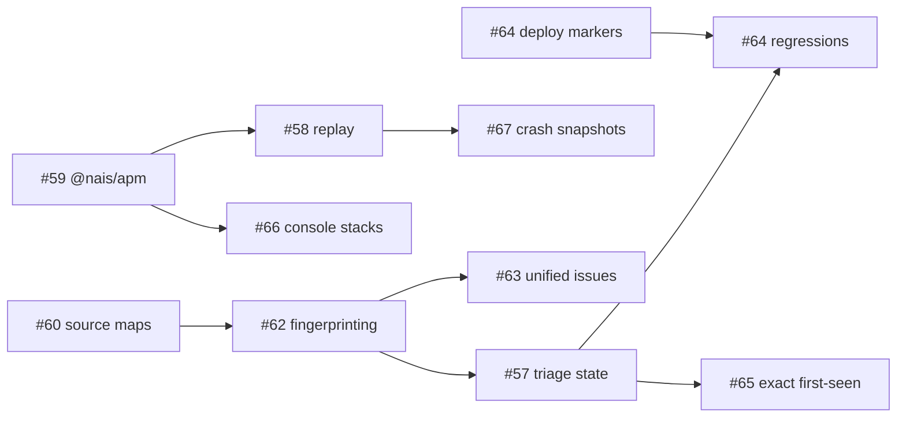

# Roadmap

> Status: updated 2026-07-04 (end of the orchestrated M6 wave on PR #71).
> Based on the PRD/research pass covering issues
> [#57](https://github.com/nais/grafana-apm-app/issues/57)–[#70](https://github.com/nais/grafana-apm-app/issues/70)
> and the extended gap analysis vs Sentry, Datadog/New Relic, and Grafana's own app layer.
> Issue numbers are the source of truth for scope; this document owns sequencing.

## Implementation status

| Milestone | Status | Notes |
|---|---|---|
| M0 Foundations | ✅ done | perf quick wins, useUrlParams, frame classifier, #36 fix, fuzzy search |
| M1 Identity + SDK | ✅ done | #62 fingerprints end-to-end; `@nais/apm` migrated to github.com/nais/apm, v0.1.0 publish-ready for GHPR (Hans: push + release); plugin `sdk/` frozen |
| M2 Alerts + releases | ✅ done | deploy markers, alert templates, versions panel, attribution, Drilldown links |
| M3 Triage | ✅ done | annotations event-log store, mutes, Regressed; nais deploy sync; new-exceptions template |
| M4 Unified issues | ✅ done | browser+server issues, source badges, trace links. Deferred: #62 P2 frame splitting (gated on #60 prod source-map adoption), server-issue drawer parity |
| M5 Replay | ✅ done (code) | capture+playback+sessions shipped; ENABLING gated on team opt-in + personvernombud conversation (Hans driving) |
| M6 Breadth | ✅ done | 2026-07-04 waves: Issues tab + all IA moves (P1–P10), #14 database tab (verified on mongodb/oracle/postgres), #35 overview health header + baseline deltas, feedback pipeline end-to-end, log patterns (pattern ingester live in prod), trace analytics (TraceQL metrics, Tempo 2.10.1), faceted issue search, global header time picker, server-issue shapes fixed, OTel pool discovery (pool_name), #30, #68 P0. Deferred to backlog: #68 P1 curation, #37 field selector, #36 topology remainder, #33/#32 alerting detail |
| M7 Platform | 🟡 in progress | ✅ SLO burn-rate templates + error-budget panel; ✅ Pyroscope tab (capability-gated, hidden until platform runs Pyroscope). In flight: Console scorecards, cron/Naisjob view, #22 map clustering, in-plugin docs links. Open: resource API docs, mobile story (deferred), app-sdk/unified-storage re-eval (upstream watch) |

### Next up (ordered — resume here)

1. **Land the in-flight M7 wave**: Console scorecards (+ observability
   readiness score), cron/Naisjob monitoring view (KSM-gated), #22 namespace
   clustering on the global map, in-plugin links to the user docs
   (docs/observability/apm in nais/doc, branch nais-apm-docs) and to the
   nais/apm SDK.
2. **Resource API docs** (M7): documented, versioned plugin resource API
   (issue PRD below) — enables CI gates and bots against /issues, /triage,
   /scorecard.
3. **#68 P1**: curated custom-metrics (per-user pins → shared jsonData with
   version/409) + Faro measurement discovery on the Frontend tab.
4. **Backlog by demand**: #37 log field selector, #36 topology remainder,
   #38 command palette, #33/#32 alerting detail pages.
5. **Housekeeping on merge**: PR #71 closes #57 #58 #61 #62 #63 #64 #65 #66
   #67 (verify each against shipped scope); update issue states.

### Open follow-ups (accumulated during implementation)

- **Smoke tests in a real env**: alert-rule `defaults=` contract against deployed
  Grafana; nais deploy sync against a real Console token; triage actor attribution
  in a browser session (curl showed "unknown").
- **AppConfig UI** fields for `naisApiUrl`/`naisApiToken` (settings exist backend-only).
- **@nais/apm first release**: Hans pushes `apm-client` + creates the v0.1.0
  GitHub release (publish workflow handles GHPR); then delete the frozen plugin
  `sdk/` copy and point docs at the package.
- **ia-review remaining**: P4/P5 (above); open questions 1–6 in docs/ia-review.md
  still want Hans's answers where not implicitly settled by the M6 wave.
- **#70 remaining**: Go module splits, otelconfig drift-test → codegen,
  DataState sweep, RuntimeTab/ServerTab refresh unification.
- **Known noise**: Loki `detected_level` false-positives on logback bootstrap
  lines can produce count-1 plain-text issue groups (sort to bottom; revisit
  with a bootstrap-line filter if teams report it).
- **QA-review leftovers (low severity, 2026-07-04 sweep)**: wrap
  `Value.Float()` sums in issues/exceptions with `safeFloat` (NaN/Inf
  defense-in-depth); migrate `handleExceptionGroups` to the shared
  `writeCached` helper; surface shape-(c) volume as an "unknown" group when
  every sampled line trims empty; dedicated unit tests for
  `queries/dsquery.go` frame-parsing edges; loading indicator while a fresh
  issueId deep link resolves groups before the drawer can open.
- **M7**: SLO/burn-rate panels, Pyroscope tab (needs platform to run Pyroscope),
  nais Console scorecards, #22 clustering, cron/Naisjob view, documented
  resource API, mobile/React Native story.

## Vision

Nais APM is the curated APM for teams running OpenTelemetry on self-hosted LGTM.
Two strategic bets:

1. **Sentry-grade error handling under one roof** — grouping, triage, releases,
   replay, and notifications for frontend *and* backend errors, built stateless
   on the data teams already ship. No LGTM-native tool offers this; Grafana Labs
   keeps its equivalent (Frontend Observability, Application Observability, SLO,
   ML) cloud-only, which protects this niche.
2. **Platform opinionation as the moat** — `@nais/apm` zero-config SDK,
   Wonderwall-aware source maps via cdn.nav.no, nais deploy integration,
   namespace=team ownership. These are things neither Grafana Cloud nor a
   generic plugin can ship.

Non-goals (declared, so they stay declared): notification delivery/paging,
synthetic check scheduling, a general dashboard builder, ML anomaly detection,
operating stateful services for the plugin.

## Tracks

Work spans three delivery tracks; every milestone lists items per track.

| Track | What | Where |
|---|---|---|
| **Plugin** | Grafana app plugin (this repo) | `nais/grafana-apm-app` |
| **SDK** | `@nais/apm` wrapper around Faro | new repo + npm |
| **Platform** | Alloy config, nais docs, CDN guidelines, meta-tag contract, nais API | nais platform repos |

## Dependency spine

The error-tracking chain is sequenced, not parallel — each stage keys on the
previous one:

Two rules fall out of this:

- **Never key triage state on the raw Alloy `hash`** (`xxh3` of the message
  only) — it splinters on dynamic message content and re-keys when #66 fixes
  serialization. Fingerprint v1 (#62) lands first.
- **Ship `@nais/apm` before triage GA** — the console-capture fix (#66) changes
  exception `value`s and therefore upstream hashes; that one-time re-key must
  happen before teams invest in triage state.

---

## M0 — Foundations & quick wins (target: v0.14)

*Theme: stop the bleeding, unblock everything downstream. All items independent — no ordering within the milestone.*

**Plugin**
- Perf quick wins from #69 (all S effort): `DependencyDetail` `withSeries=false`;
  singleflight on `respCache`; `|=` line filters + explicit range in
  `ExceptionDrawer` queries; memoize `usePluginLabelOverrides` (kills a refetch-loop
  class); fix the Ops Board frozen time window; clamp `step` on `/services`;
  cache `/dependencies`.
- #70 item 1: atomic `useUrlParams` batch helper + jest/playwright tests — turns
  the 0.13.2–0.13.4 drawer-loop patch series into a guarded rule.
- #66 Phase 0 (retroactive, no re-ingest): shared in-app frame classifier
  (Go `pkg/plugin/fingerprint` + TS mirror, golden fixtures); ExceptionDrawer
  collapses SDK/vendor frames, highlights first in-app frame, badges
  `console.error:` captures.
- #65 Phase 0: freeze the drawer URL contract; surface Grafana-managed alert
  rules alongside Mimir ruler rules.
- #36 correctness fix pulled forward: replace the hardcoded `[5m]` service-graph
  rate window with the page time range.
- #61 fuzzy service search (fuse.js — S effort, high daily-use value).

**SDK**
- **Claim the `@nais` npm scope immediately** (unclaimed as of 2026-07 — squatting risk).
- Repo scaffolding, CI with provenance publishing.

**Platform**
- #60 Phase 0: Alloy `faro.receiver` config — `download_from_origins = ["https://cdn.nav.no"]`,
  `download_timeout = "4s"`, `error_cleanup_interval = "10m"`; publish the
  "Frontend source maps on Nais" guideline (upload-before-deploy ordering).
- File the upstream `grafana/faro-web-sdk` issue for any-position Error
  extraction + Error-aware serializer (#66 Phase 2 — cheap now, long lead time).

**Exit criteria:** a reference app following the CDN guideline shows fully
symbolicated stacks in the drawer; existing minified/console exceptions render
with SDK frames collapsed; no wallboard cache stampedes; drawer URL params are
a documented contract.

---

## M1 — Stable issue identity + `@nais/apm` core (target: v0.15)

*Theme: the keystone. Everything Sentry-shaped keys on this.*

**Plugin**
- #62 Phase 0: `pkg/plugin/fingerprint` (tiers: `context_fingerprint` override →
  type + normalized message → message → hash passthrough; versioned `v1:` prefix);
  `GET /exceptions/groups` endpoint merging upstream hash groups; Top Exceptions
  + drawer keyed on fingerprint with `merged from N raw hashes` badge; legacy
  `hash` URLs still resolve.
- #69 M items: respCache on all read handlers (split TTLs), sparklines for
  visible inventory rows only, scoped namespace service-graph queries.
- #70 item 2: extract ExceptionDrawer pure helpers + typed hooks (pre-work for
  #63's backend move).

**SDK**
- #59 Phase 0: `init()` with meta-tag/env resolution, Sentry-compat API
  (`captureException`, `captureMessage`, `setUser`, `setTag`/`setContext`),
  mandatory PII scrubber (fnr/email/token-URLs), default `ignoreErrors`,
  opt-in tracing restricted to same-origin + `*.nav.no`.
- #66 Phase 1: replacement console instrumentation — Error found in any arg
  position → push it with the original stack; depth-limited JSON for object args.
- #62 Phase 1: `fingerprint` option → `context.fingerprint` (tier-0 override).
- Migration guide from `@sentry/react`; one pilot team migrated.

**Platform**
- Meta-tag contract (`nais-app`/`nais-cluster`/`nais-version`/`nais-telemetry-url`)
  filed with the platform team; SDK reads build-time env as the stopgap.

**Exit criteria:** one logical error = one group (UUID/ID-bearing messages
merge); pilot team's `console.error('msg', err)` events carry real stacks;
`@nais/apm@0.x` on npm with the pilot's exceptions grouping correctly.

---

## M2 — Notified developers, release context (target: v0.16)

*Theme: close the loop — from "error exists" to "the team knows, and knows which deploy did it". No state dependencies; runs before triage deliberately.*

**Plugin**
- #65 Phase 1: "Create alert" buttons → pre-filled Grafana rule form
  (`/alerting/new?defaults=`) for error-rate spike, per-fingerprint exception
  spike, and web-vitals degradation; annotations deep-link back to the drawer.
- #64 Phase 1: deploy markers on RED + frontend charts via `AnnotationsDataLayer`;
  Versions panel (occurrences, adoption, error-free-session rate per version);
  "New in \<version\>" badges.
- Gap quick wins: web-vitals attribution surfacing (data already flows in Faro
  v2 — UI-only); Drilldown app deep links replacing classic Explore links +
  inbound `Open in Nais APM` link extensions.

**SDK**
- `app.version`/`app.release` default to the build commit SHA (the join key
  against nais `Deployment.commitSha` and the CDN path).

**Platform**
- #64 Phase 0: deploy-annotation contract + reusable GitHub Action
  (`nais/apm-deploy-annotation@v1`).

**Exit criteria:** a Slack notification created from the drawer deep-links back
to the exact exception; a deploy shows as a marker on every chart within one
refresh; "did this start with today's release?" answerable from the versions panel.

---

## M3 — Triage (target: v0.17)

*Theme: the Sentry workflow — resolve, ignore, assign, regress.*

**Plugin**
- #57 Phase 0: per-user mutes (`usePluginUserStorage`), query-time "New" and
  seen-in-versions badges.
- #57 Phase 1: shared triage on the **Grafana org-annotations event log**
  (`TriageStore` interface, newest-event-wins fold, actor + audit history,
  default view hides resolved/ignored); health check warning on annotation
  retention config.
- #64 Phase 2: nais GraphQL API deploy sync (idempotent via `deploy-id` tag);
  regression semantics — resolved-in-version X + occurrence on a later deploy
  → **Regressed**, bubbled to top.
- #65 Phase 2a: "new exceptions" LogQL approximation template (shipped behind an
  honest explainer); file 2b requirements (issue-event metric) against #57.

**Exit criteria:** resolve/ignore/assign visible to all users on all replicas
within 30s with zero new infrastructure; a resolved issue reappearing in a newer
deploy flips to Regressed; kill-two-replicas HA test documented.

---

## M4 — Unified Issues: backend error tracking (target: v0.18)

*Theme: one issues list across client and server — the differentiator no LGTM-native tool has.*

**Plugin**
- #63 Phase 0: reframe frontend errors as the Issues list (source badges,
  `issueId` URL param with back-compat).
- #63 Phase 1: backend exceptions from Loki logs (shape probe: OTLP structured
  metadata vs JSON body; shared fingerprint pipeline); drawer parity for server
  issues (pods/endpoints/versions impact, Logs deep link).
- #63 Phase 2: representative-trace enrichment via Tempo ≥ 2.6 event-scope
  TraceQL (capability probe + fallback).
- #62 Phase 2: frame-based fingerprint splitting (tier 1) — now possible because
  #60 symbolication is in place; on-demand "split by stack" in the drawer first.
- Triage (#57) extends to server issues (store design already source-agnostic).

**Exit criteria:** "checkout is broken" is answerable from one Issues tab —
browser TypeError and backend PSQLException side by side, each with stack,
impact, and a trace link; frontend error cross-links to the backend error that
caused it (same trace_id) for `@nais/apm` apps.

---

## M5 — Replay & visual context (target: v0.19)

*Theme: see what the user saw. Gated on `@nais/apm` adoption and privacy sign-off.*

**Plugin**
- #70 item 5 first: bundle strategy — CI size budget, re-enable code-splitting
  safely (the lazy-loaded 4.8 MB rrweb player cannot ride `maxChunks: 1`).
- #67: masked DOM snapshot rendering (static frame, masked badge, empty states).
- #58: full error-triggered replay playback (chunk reassembly, seek-to-error,
  exception markers, privacy/retention notice).
- **Sessions page** (gap-analysis item): session/user search + standalone
  session timeline — the user-centric entry point support teams ask for, and
  the natural home for replay beyond the drawer.

**SDK**
- #67 capture: `screenshotOnError: true` — rrweb single snapshot, masking floor
  non-overridable, per-fingerprint throttling. Ships first (Phase 0 spike
  validates sizes/latency); exercises the whole chunked-transport pipeline.
- #58 recording: `mode: 'on-error'` ring buffer (~60–120 s), gzip+base64 chunks
  < 96 KB into `kind="replay"`.

**Platform**
- Alloy `loki.process` stage: `kind="replay"` stream label + 7-day
  `retention_stream`; DPIA/personvernombud process for citizen-facing apps
  (internal apps first).

**Exit criteria:** Phase 0 spike numbers recorded on #67/#58 (go/no-go);
pilot internal app plays back an error-triggered replay in the drawer; every
Loki line stays under default limits with zero config changes.

---

## M6 — APM breadth (target: v0.20+)

*Theme: close the commercial-APM gaps beyond error tracking. Items are independent — pull by demand.*

- ✅ #35 Overview redesign: instant health signal, baseline deltas vs previous
  period (the pragmatic anomaly-detection substitute), deploy-marker context.
  Shipped 2026-07-04 (health header reuses /health prev-period data).
- ✅ #14 Database tab: query analytics from spans + pool health. Shipped
  2026-07-04, verified live on mongodb/oracle/postgres apps; requirements
  empty states double as interim instrumentation docs. Follow-up: /runtime
  `pool_name` label fix (see Next up).
- #68 custom metrics: Phase 0 auto-discovery (denylist inversion of
  `runtime.go`), Faro custom measurements surfaced in FrontendTab; Phase 1
  curation (per-user pins → shared jsonData config with version/409).
- **Log patterns**: Patterns view in LogsTab + "new error patterns" card —
  strongest incident-triage gap found vs Datadog. UPDATE 2026-07-04: the Loki
  pattern ingester is already enabled in production (no platform ask); see
  docs/plans/log-patterns-trace-analytics.md for the probe evidence and plan.
- **Trace analytics**: TraceQL-metrics group-by-attribute latency/error
  breakdowns (the "which tag explains the p99" view). UPDATE 2026-07-04:
  confirmed working live on Tempo 2.10.1; plan in the same doc.
- ✅ **User feedback widget**: `@nais/apm` feedback API → Loki stream → feedback
  joined to issues by fingerprint in the drawer. Shipped 2026-07-04.
- Faceted exception search (version/browser/page/user facets) + triage-status
  filter facets.
- #36 remaining topology work, #33/#32 alerting detail, #30 auto-refresh
  (via #70 item 4's unified time-range/refresh), #37 log field selector.
- #70 continuing: Go module splits, otelconfig drift test → codegen,
  `DataState` consistency sweep.

---

## M7 — Platform maturity (target: 1.0)

*Theme: the "everything under one roof" endgame. Each item needs a platform decision or upstream movement — start the conversations in M5–M6.*

- **SLO / error budgets**: multi-window burn-rate rule generation + budget
  panels on RED metrics (Grafana SLO is cloud-only — defensible OSS niche).
- **Pyroscope**: Profiling tab + span-profile links, gated on a platform
  decision to run Pyroscope (datasource-detection pattern already exists).
- **Service scorecards**: ownership/runbook/repo enrichment from nais Console
  API + "observability readiness" score per service.
- #22 global service map with namespace clustering.
- Cron/Naisjob monitoring view from kube-state-metrics.
- React Native / mobile story (`@grafana/faro-react-native` is official now).
- Documented, versioned resource API (CI gates, bots).
- Re-evaluate `grafana-app-sdk` unified storage for triage state (replace the
  annotations store if GA for external plugins); re-evaluate upstream Faro
  replay/source-map/debug-ID movement and delete custom code where upstream
  caught up.

---

## Standing risks

| Risk | Owner milestone | Mitigation |
|---|---|---|
| `@nais` npm scope squatted | M0 | claim now; fallback `@navikt/apm` |
| Alloy hash re-key when #66 rolls out | M1 | sequence before triage GA; documented on #57/#62 |
| Grafana `defaults=` alert-form contract is internal | M2 | server-side template rendering; migrate to the stable extension component |
| Annotation retention config deletes triage history | M3 | startup health check (#57) |
| DPIA for replay on citizen-facing apps | M5 | internal apps first; masking floor non-overridable; legal sign-off gate |
| Faro/Alloy major-version churn (custom console + replay instrumentations) | M1/M5 | pin versions; upstream issues filed; deletion paths documented |
| Grafana Labs OSS-ifies its app layer | — | differentiate on nais opinionation + triage + OSS replay; keep wire formats vanilla |
